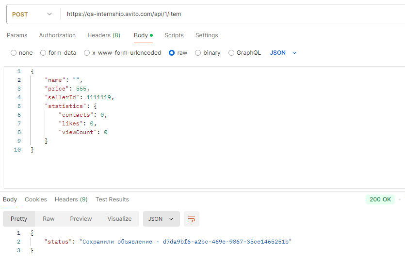
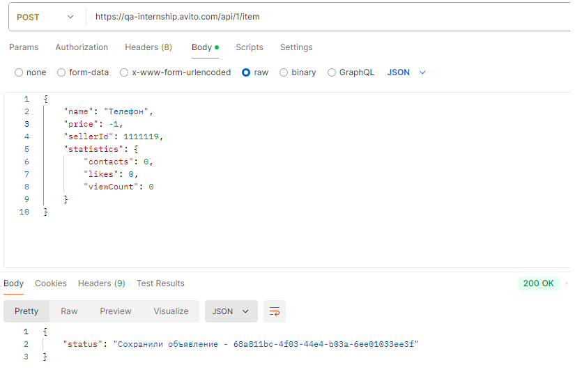
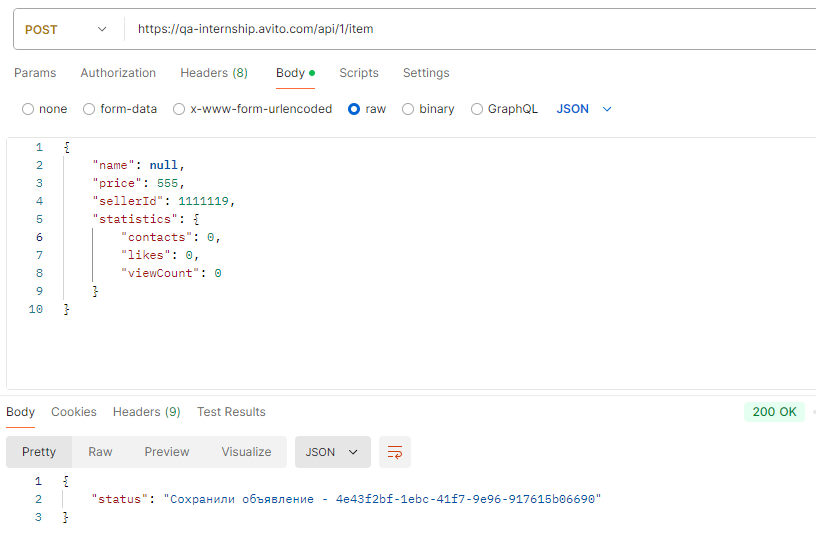
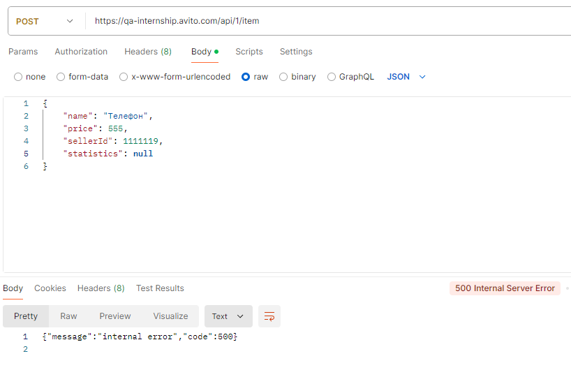
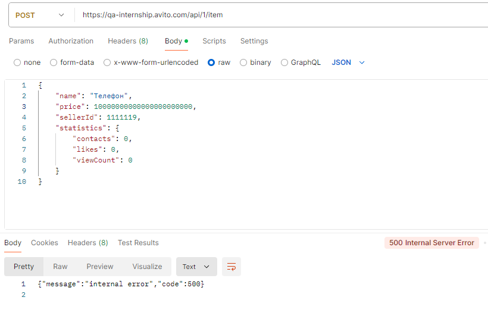
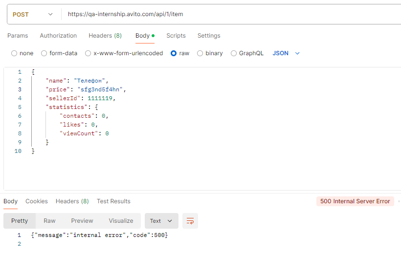
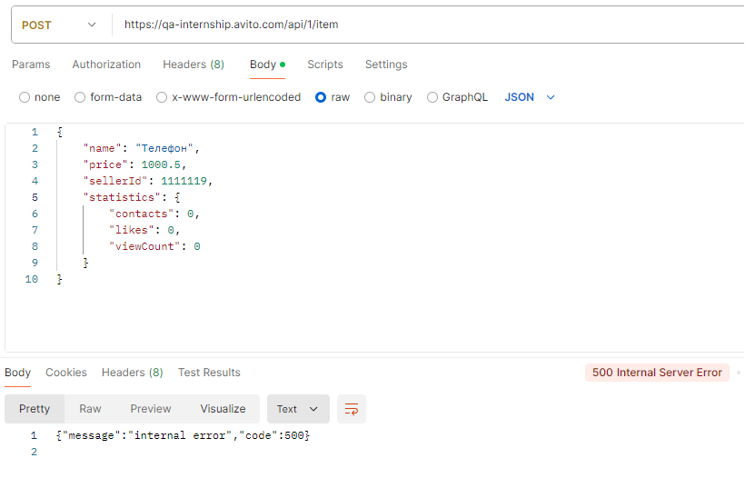
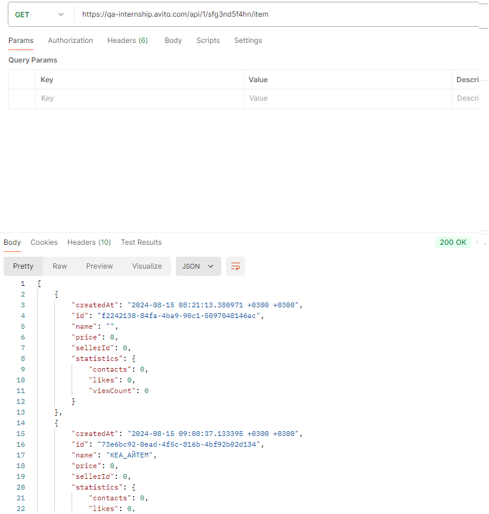

## Bug report для API

---

1. Некорректная обработка невалидных полей объекта  
* *Некорректная обработка поля 'name'*  
**Приоритет**: HIGH  
**Шаги воспроизведения**  
  * Отправить POST запрос на адрес https://qa-internship.avito.com/api/1/item, в теле запроса передать объект с пустым полем 'name'  
  * Проделать то же, указав в поле 'name' произвольное число пробелов  
  
Пример
```
{
    "name": "",
    "price": 555,
    "sellerId": 1111119,
    "statistics": {
        "contacts": 0,
        "likes": 0,
        "viewCount": null
    }
}
```

  **Ожидаемый результат**  
Для каждого запроса HTTP status code - 400  
**Фактический результат**  
Для каждого запроса HTTP status code - 200  
Пример:  
  

---

* *Некорректная обработка отрицательных значений полей объекта*  
**Приоритет**: HIGH  
**Шаги воспроизведения**  
  * Отправить POST запрос на адрес https://qa-internship.avito.com/api/1/item, в теле запроса передать объект с отрицательным значением числового поля 'price' 
  * Проделать то же для каждого числового поля  


Пример
```
{
    "name": "Телефон",
    "price": -1,
    "sellerId": 1111119,
    "statistics": {
        "contacts": 0,
        "likes": 0,
        "viewCount": 0
    }
}
```
  
  **Ожидаемый результат**  
Для каждого запроса HTTP status code - 400  
  **Фактический результат**  
Для каждого запроса HTTP status code - 200  
Пример:  
  

---

* *Некорректная обработка полей объекта при передаче 'null'*  
**Приоритет**: HIGH  
  **Шаги воспроизведения**
  * Отправить POST запрос на адрес https://qa-internship.avito.com/api/1/item, в теле запроса передать объект со значением поля 'name' = null
  * Проделать то же для каждого поля, включая поля для вложенного объекта statistic.


Пример
```
{
    "name": null,
    "price": 555,
    "sellerId": 1111119,
    "statistics": {
        "contacts": 0,
        "likes": 0,
        "viewCount": 0
    }
}
```

  **Ожидаемый результат**  
  Для каждого запроса HTTP status code - 400  
  **Фактический результат**  
  Для каждого запроса HTTP status code - 200
  При передаче объекта null и объекта с полем statistic = null - HTTP status code - 500  
Пример:  
    
    

---

* *Некорректная обработка больших значений числовых полей объекта*  
  **Приоритет**: HIGH  
  **Шаги воспроизведения**
  * Отправить POST запрос на адрес https://qa-internship.avito.com/api/1/item, в теле запроса передать объект с большим значением числового поля 'price'
  * Проделать то же для каждого числового поля  
    Пример
```
{
    "name": "Телефон",
    "price": 10000000000000000000000,
    "sellerId": 1111119,
    "statistics": {
        "contacts": 0,
        "likes": 0,
        "viewCount": null
    }
}
```

**Ожидаемый результат**  
Для каждого запроса HTTP status code - 200 или 400 с указанием предела по значению 
**Фактический результат**  
Для каждого запроса HTTP status code - 500
Пример:  
  

---

* *Некорректная обработка полей объекта, требующих числового значения, при присвоении им строки*  
  **Приоритет**: HIGH  
  **Шаги воспроизведения**
  * Отправить POST запрос на адрес https://qa-internship.avito.com/api/1/item, в теле запроса передать объект со строковым значением числового поля 'price'
  * Проделать то же для каждого числового поля  
    Пример
```
{
    "name": "Телефон",
    "price": "sfg3nd5f4hn",
    "sellerId": 1111119,
    "statistics": {
        "contacts": 0,
        "likes": 0,
        "viewCount": null
    }
}
```

**Ожидаемый результат**  
Для каждого запроса HTTP status code - 400  
**Фактический результат**  
Для каждого запроса HTTP status code - 500
Пример:  


---

* *Некорректная обработка полей объекта, требующих числового значения, при присвоении им вещественного числа*  
**Приоритет**: HIGH  
  **Шаги воспроизведения**
  * Отправить POST запрос на адрес https://qa-internship.avito.com/api/1/item, в теле запроса передать объект с вещественным значением числового поля 'price'
  * Проделать то же для каждого числового поля  
    Пример
```
{
    "name": "Телефон",
    "price": 1000.5,
    "sellerId": 1111119,
    "statistics": {
        "contacts": 0,
        "likes": 0,
        "viewCount": null
    }
}
```

**Ожидаемый результат**  
Для каждого запроса HTTP status code - 200 или 400 с указанием вводить только целые числа  
**Фактический результат**  
Для каждого запроса HTTP status code - 500
Пример:  


---

2. Некорректная обработка запроса на выдачу всех объявлений несуществующего ID продавца  
**Приоритет**: HIGH  
**Шаги воспроизведения**
   * Отправить GET запрос на адрес https://qa-internship.avito.com/api/1/sfg3nd5f4hn/item

**Ожидаемый результат**  
HTTP status code - 404  
**Фактический результат**  
Для каждого запроса HTTP status code - 200
Пример:  
