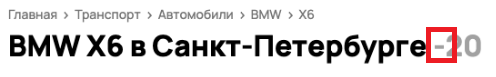

## Описание багов со скриншота

1. **Вывод результатов не соответствует примененным фильтрам**
   * В описании карточки указан передний привод (в параметрах фильтра - полный привод)  
  **Приоритет:** HIGH  
   
   * В описании карточки указана марка Mercedes-Benz (в параметрах фильтра BMW)  
     **Приоритет:** HIGH  
      
   * В описании карточки указан год 2019 (в параметрах фильтра от 2021)  
     **Приоритет:** HIGH  
       
   * В результатах выдачи лобовое стекло (в параметрах фильтра указаны автомобили)  
     **Приоритет:** HIGH  
       
2. **Некорректный радиус поиска**
   *  Вывод карточек из других городов: радиус поиска Санкт-Петербург. Карточки отображаются из других местоположений  
      **Приоритет:** HIGH  
      
      
        
      
      
        
   В оригинале сайта указание локации "Санкт-Петербург" приводит к выдаче среди результатов "Москва". Баг ли это?
3. Отсутствует изображение автомобиля  
   **Приоритет:** HIGH  

4. Отличается заголовок и характеристики карточки авто  
   * В кратком описании карточки указано лобовое стекло, в описании ниже информация об автомобиле, а не о стекле  
     **Приоритет:** HIGH  
     
   * В описании карточки и в заголовке указан разный пробег: 72000 км и 97755 км  
     **Приоритет:** HIGH  
     
   * В описании карточки и в заголовке  разный объем двигателя: 1.5 AT и 3AT  
     **Приоритет:** HIGH  
     
5. Отсутствует текст у кнопки в баннере "Скидки на новое авто"  
   **Приоритет:** HIGH - если кнопка не рабочая, MEDIUM - если проблема в отображении текста  
   
6. Некорректное отображение/масштабирование фото карточки авто  
   **Приоритет:** MEDIUM  
   
7. Не срабатывает алгоритм скрытия номера авто. Не затёрт номер на автомобиле.  
   **Приоритет:** MEDIUM  
   
8. Некорректная вёрстка плашки относительно карточки автомобиля  
   * Плашка "Соответствует оценке" смещена относительно карточки авто  
     **Приоритет:** MEDIUM  
     
9. Некорректное срабатывание алгоритма валидации карточки авто  
   * На изображении кузов BMW, в описании карточки Mercedes-Benz  
     **Приоритет:** MEDIUM  
     
10. Некорректная вёрстка в заголовке  
    * В заголовке «BMW X6 в Санкт-Петербурге -20» указан дефис  
      **Приоритет:** LOW  
      
11. Грамматическая ошибка в описании  
    * В описании карточки грамматическая ошибка "2 дни назад"  
      **Приоритет:** LOW  
      
12. Пиктограмма "Добавить в избранное" не в поле описания товара  
    **Приоритет:** LOW  
    